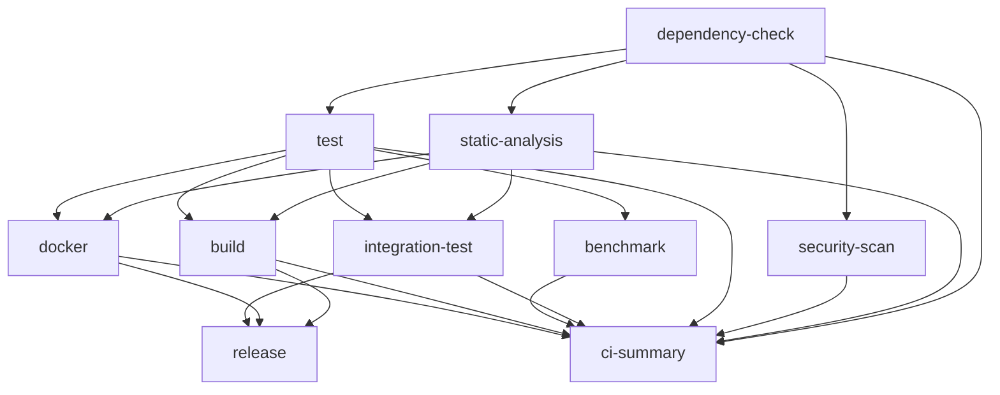

# CI/CDパイプライン ガイド

## 概要

このプロジェクトでは、GitHub Actionsを使用した包括的なCI/CDパイプラインを実装しています。このパイプラインは、コード品質の維持、セキュリティの確保、自動リリースプロセスをサポートします。

## 目次

- [パイプライン構成](#パイプライン構成)
- [ワークフロー詳細](#ワークフロー詳細)
- [ツール管理](#ツール管理)
- [設定ファイル](#設定ファイル)
- [使用方法](#使用方法)
- [トラブルシューティング](#トラブルシューティング)

## パイプライン構成

### メインワークフロー (`.github/workflows/ci.yml`)

メインのCI/CDワークフローは以下のイベントでトリガーされます：

- `push`: main、develop、feature/**、release/** ブランチへのプッシュ
- `pull_request`: mainまたはdevelopブランチへのプルリクエスト
- `schedule`: 毎週月曜日の午前2時（セキュリティスキャン）
- `workflow_dispatch`: 手動トリガー（テストスキップオプション付き）

### ジョブ構成



## ワークフロー詳細

### 1. 依存関係チェック (`dependency-check`)

**目的**: プロジェクトの依存関係の健全性を確認

**実行内容**:
- `go mod verify`: モジュールの整合性チェック
- `go mod tidy`: 不要な依存関係の削除
- `govulncheck`: 脆弱性のある依存関係の検出
- `go-licenses`: ライセンス互換性チェック

**設定例**:
```yaml
- name: Check for vulnerable dependencies
  run: |
    .tools/bin/govulncheck ./...
```

### 2. 静的解析 (`static-analysis`)

**目的**: コード品質とスタイルの確認

**使用ツール**:
- **golangci-lint**: 50以上のリンターを統合
- **staticcheck**: 高度な静的解析
- **ineffassign**: 無効な代入の検出
- **revive**: 拡張可能なGoリンター
- **gofmt/goimports**: コードフォーマット

**golangci-lint設定** (`.golangci.yml`):
```yaml
linters:
  enable:
    - errcheck
    - gosimple
    - govet
    - ineffassign
    - staticcheck
    - unused
    # ... その他50以上のリンター
```

### 3. セキュリティスキャン (`security-scan`)

**目的**: セキュリティ脆弱性の検出

**使用ツール**:
- **Gosec**: Goコード専用のセキュリティスキャナー
- **Trivy**: ファイルシステムの脆弱性スキャン
- **CodeQL**: GitHubのセマンティックコード分析

**SARIF形式での結果アップロード**:
```yaml
- name: Upload Gosec SARIF
  uses: github/codeql-action/upload-sarif@v3
  with:
    sarif_file: gosec-results.sarif
```

### 4. テスト (`test`)

**目的**: 単体テストの実行とカバレッジ測定

**マトリックス戦略**:
- Go バージョン: 1.22, 1.23.0
- OS: Ubuntu, macOS, Windows

**テスト実行**:
```bash
# 単体テスト（レースディテクター付き）
go test -v -race -short -shuffle=on -coverprofile=coverage.txt -covermode=atomic ./...

# カバレッジアップロード
codecov/codecov-action@v4
```

### 5. ベンチマークテスト (`benchmark`)

**目的**: パフォーマンスの測定と回帰検出

**実行条件**: mainブランチへのプッシュ時のみ

**機能**:
- ベンチマーク結果の保存
- パフォーマンス回帰の自動検出（150%閾値）
- 結果の可視化

### 6. 統合テスト (`integration-test`)

**目的**: エンドツーエンドテストの実行

**環境構成**:
- Redisサービスコンテナ
- テスト用環境変数設定
- MCPエンドポイントテスト

**テストシナリオ**:
```bash
make test-mcp-init
make test-mcp-tools
make test-transcript
make test-api
```

### 7. ビルド (`build`)

**目的**: マルチプラットフォームバイナリの生成

**ビルドマトリックス**:
- Linux (amd64, arm64)
- macOS (amd64, arm64)
- Windows (amd64, arm64)

**ビルドフラグ**:
```bash
CGO_ENABLED=0 go build \
  -ldflags="-w -s -X main.Version=${VERSION} -X main.BuildTime=${BUILD_TIME} -X main.GitCommit=${COMMIT}" \
  -o output \
  ./cmd/server
```

### 8. Dockerビルド (`docker`)

**目的**: マルチアーキテクチャDockerイメージの作成

**機能**:
- GitHub Container Registry (ghcr.io)へのプッシュ
- マルチアーキテクチャサポート (linux/amd64, linux/arm64)
- 脆弱性スキャン（Trivy）

### 9. リリース (`release`)

**目的**: 自動リリースの作成

**トリガー**: `v*`タグのプッシュ時

**機能**:
- リリースアセットの整理
- チェックサムファイルの生成
- 変更履歴の自動生成
- GitHub Releaseの作成

## ツール管理

### Go 1.24 tool directive

Go 1.24から導入された`tool`ディレクティブを使用してツールを管理しています。

**go.mod**:
```go
tool github.com/golangci/golangci-lint/cmd/golangci-lint
tool github.com/securego/gosec/v2/cmd/gosec
tool golang.org/x/tools/cmd/goimports
// ... その他のツール
```

### Makefileターゲット

**ツールのインストール**:
```bash
# すべてのツールをインストール
make tools

# 特定のツールをインストール
make install-golangci-lint

# ツールの更新
make tools-update

# ツールの検証
make tools-verify
```

## 設定ファイル

### 1. `.golangci.yml`

golangci-lintの設定ファイル。50以上のリンターを有効化し、プロジェクト固有のルールを定義。

**主な設定**:
- タイムアウト: 10分
- テストファイルを含む
- ビルドタグ: `integration`
- 除外ディレクトリ: vendor, testdata

### 2. `.github/dependabot.yml`

依存関係の自動更新設定。

**更新対象**:
- Go modules (週次)
- GitHub Actions (週次)
- Docker (週次)

### 3. `.goreleaser.yml`

GoReleaserの設定ファイル。リリースプロセスを自動化。

**機能**:
- クロスプラットフォームビルド
- Dockerイメージ作成
- パッケージ作成 (deb, rpm, apk)
- Homebrew/Scoop対応

## 使用方法

### プルリクエストの作成

1. フィーチャーブランチを作成
   ```bash
   git checkout -b feature/new-feature
   ```

2. 変更をコミット
   ```bash
   git add .
   git commit -m "feat: 新機能を追加"
   ```

3. プッシュしてPRを作成
   ```bash
   git push origin feature/new-feature
   ```

4. CI/CDパイプラインが自動的に実行される

### リリースの作成

1. バージョンタグを作成
   ```bash
   git tag v1.2.3
   git push origin v1.2.3
   ```

2. リリースワークフローが自動的に実行される

### 手動でのワークフロー実行

GitHub Actionsページから`workflow_dispatch`を使用して手動実行可能。

オプション:
- `skip_tests`: テストをスキップ（デバッグ用）

## トラブルシューティング

### よくある問題

#### 1. golangci-lintのタイムアウト

**問題**: リンターが10分のタイムアウトに達する

**解決策**:
```yaml
args: --timeout=15m
```

#### 2. Codecovトークンエラー

**問題**: カバレッジのアップロードが失敗

**解決策**:
1. リポジトリ設定で`CODECOV_TOKEN`シークレットを追加
2. Codecovダッシュボードでトークンを取得

#### 3. Dockerビルドの失敗

**問題**: マルチアーキテクチャビルドが失敗

**解決策**:
```yaml
- name: Set up QEMU
  uses: docker/setup-qemu-action@v3
```

### デバッグ方法

#### ローカルでのCI環境再現

```bash
# ツールのインストール
make tools

# リンターの実行
make lint

# テストの実行
make test-coverage

# 統合テストの実行
make test-integration
```

#### ワークフローのデバッグ

1. `ACTIONS_STEP_DEBUG`シークレットを`true`に設定
2. ワークフローを再実行
3. 詳細なログを確認

## ベストプラクティス

### 1. コミットメッセージ

Conventional Commitsを使用:
- `feat:` 新機能
- `fix:` バグ修正
- `docs:` ドキュメント
- `style:` フォーマット
- `refactor:` リファクタリング
- `test:` テスト
- `chore:` その他

### 2. ブランチ戦略

- `main`: プロダクションリリース
- `develop`: 開発ブランチ
- `feature/*`: 機能開発
- `release/*`: リリース準備
- `hotfix/*`: 緊急修正

### 3. セキュリティ

- シークレットは環境変数で管理
- 依存関係は定期的に更新
- セキュリティアラートに迅速に対応

## まとめ

このCI/CDパイプラインは、コード品質の維持、セキュリティの確保、効率的なリリースプロセスを実現します。継続的な改善により、開発チームの生産性を向上させ、信頼性の高いソフトウェアを提供できます。